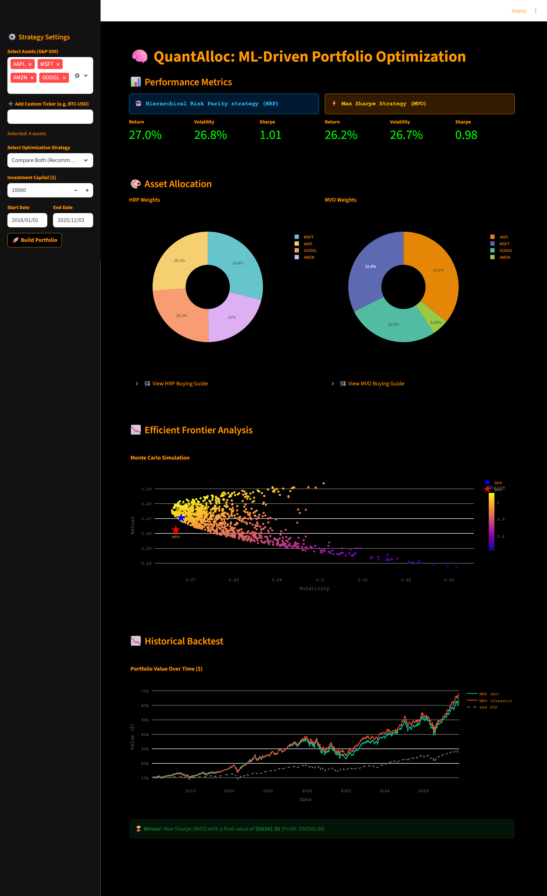

# 🧠 QuantAlloc: ML-Driven Portfolio Optimization

[](https://quantalloc.streamlit.app)


> **"Intelligent Portfolio Architect"** — Bridging the gap between Modern Machine Learning and Classical Financial Theory.
**QuantAlloc** is a professional-grade financial dashboard designed to build robust investment portfolios. Unlike simple allocation tools, it compares **Hierarchical Risk Parity (HRP)**—a machine learning approach using graph theory—against the classic **Mean-Variance Optimization (MVO)** model.

Packed with a **Bloomberg-inspired dark theme**, dynamic risk-free rate calculations, and Monte Carlo simulations, it provides institutional-grade analytics in an accessible web interface.

---

## 🚀 Key Features

### 🤖 1. Dual-Engine Strategy (ML vs. Classical)
* **Hierarchical Risk Parity (HRP):** A robust ML algorithm that clusters assets based on their correlation structure. It creates diversified portfolios that are less sensitive to market noise and requires **no expected return assumptions**.
* **Max Sharpe (MVO):** The classic Markowitz model that mathematically maximizes risk-adjusted returns based on historical covariance and a dynamic risk-free rate.

### 🎨 2. Professional "Terminal" Aesthetic
* High-contrast **Pitch Black & Orange** theme for maximum readability.
* Interactive, publication-quality charts powered by **Plotly**.

### 📊 3. Advanced Analytics
* **Dynamic Risk-Free Rate:** Automatically fetches the live **10-Year Treasury Yield (`^TNX`)** to calculate accurate Sharpe Ratios.
* **Monte Carlo Simulation:** Simulates **2,000+ random portfolios** to visualize the Efficient Frontier.
* **Historical Backtesting:** Compares your strategy against the **S&P 500 (SPY)** benchmark over any custom timeframe.

### 🛒 4. Actionable Insights
* **Discrete Allocation:** Converts theoretical weights into exact integer share counts based on your capital.
* **Buying Guide:** Generates a precise "Shopping List" for your broker.

---

## 🛠️ Tech Stack

* **Frontend:** `Streamlit` (Interactive Web UI)
* **Financial Data:** `yfinance` (Yahoo Finance API)
* **Optimization Engine:** `PyPortfolioOpt` (Convex Optimization & Clustering)
* **Visualization:** `Plotly` (Interactive Financial Charts)
* **Data Processing:** `Pandas`, `NumPy`, `SciPy`

---

## 📊 Data Source

The application fetches real-time and historical market data using the **Yahoo Finance API** (`yfinance`).

* **Universe:** S&P 500 constituents (fetched dynamically from GitHub) plus user-defined custom tickers (Crypto, ETFs, etc.).
* **Preprocessing:** Data is cleaned for missing values, and the **Risk-Free Rate** is calculated as the average yield over the selected time period to ensure backtesting accuracy.

---

## 📸 Demo & Performance

### Dashboard Overview
*The interface provides a side-by-side comparison of the AI-driven HRP strategy versus the classical Max Sharpe approach. It visualizes asset allocation, performance metrics, and the efficient frontier in real-time.*



### Efficient Frontier Analysis
*The Monte Carlo simulation generates thousands of random portfolios to map the risk/return landscape, highlighting exactly where the optimized strategies sit relative to the market potential.*

---

## 🛠️ Installation & Usage

### Option 1: Run Locally (Python)

1.  **Clone the repository:**
    ```bash
    git clone [https://github.com/YOUR_USERNAME/QuantAlloc.git](https://github.com/YOUR_USERNAME/QuantAlloc.git)
    cd QuantAlloc
    ```

2.  **Install Dependencies:**
    ```bash
    pip install -r requirements.txt
    ```

3.  **Run the App:**
    ```bash
    streamlit run app.py
    ```

---

## 📂 Project Structure

```text
QuantAlloc/
├── app.py                 # Main Streamlit Application (UI + Logic)
├── requirements.txt       # Python dependencies (yfinance, PyPortfolioOpt, etc.)
├── README.md              # Project documentation
├── assets/                # Images and static assets
└── .gitignore             # Files to ignore (e.g., venv, pycache)
```
---

## ⚠️ Constraints & Future Roadmap
* **Data Source**: Currently relies on the unofficial yfinance API. In a production environment, this would be replaced with a paid provider (e.g., Polygon.io or Bloomberg) to guarantee uptime and prevent rate-limiting.

* **Optimization Speed**: HRP clustering on extremely large universes (500+ tickers simultaneously) can be computationally intensive. Future iterations could implement parallel processing.

* **Asset Classes**: Currently optimized for Equities/ETFs. Future updates will include native support for Bonds and Options handling.

---

## ⚖️ Disclaimer
**For Educational Purposes Only.**

This application is designed for quantitative analysis and research. It does not constitute financial advice, and the creator is not responsible for any financial losses incurred from using this tool. Always conduct your own due diligence before trading.

---

## 👨‍💻 Author
Bhagyashree Yadav